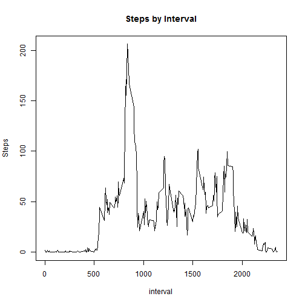

```r
library(ggplot2)
library(dplyr)
```

---
title: 'Reproducible Research: Peer Assessment 1'
output:
  html_document:
    highlight: pygments
    keep_md: yes
    toc: yes
---


## Loading and preprocessing the data


```r
activity <- read.csv(file="activity.csv", stringsAsFactor = FALSE)
activity <- tbl_df(activity)
activity_bkp <- activity
```
Numbers 0f complete cases:

```r
sum(complete.cases(activity))
```

```
## [1] 15264
```
Filtering only complete cases:

```r
activity <- activity[complete.cases(activity),]
activity$date <- as.Date(activity$date, format = "%Y-%m-%d")
```
Grouping by day:

```r
activity_grouped_day <- select(activity,  -interval) %>%
                        group_by(date) %>%
                        summarise(mean_steps_day = mean(steps)) 
summary(activity_grouped_day)
```

```
##       date            mean_steps_day   
##  Min.   :2012-10-02   Min.   : 0.1424  
##  1st Qu.:2012-10-16   1st Qu.:30.6979  
##  Median :2012-10-29   Median :37.3785  
##  Mean   :2012-10-30   Mean   :37.3826  
##  3rd Qu.:2012-11-16   3rd Qu.:46.1597  
##  Max.   :2012-11-29   Max.   :73.5903
```

```r
activity_grouped_day
```

```
## Source: local data frame [53 x 2]
## 
##          date mean_steps_day
## 1  2012-10-02      0.4375000
## 2  2012-10-03     39.4166667
## 3  2012-10-04     42.0694444
## 4  2012-10-05     46.1597222
## 5  2012-10-06     53.5416667
## 6  2012-10-07     38.2465278
## 7  2012-10-09     44.4826389
## 8  2012-10-10     34.3750000
## 9  2012-10-11     35.7777778
## 10 2012-10-12     60.3541667
## 11 2012-10-13     43.1458333
## 12 2012-10-14     52.4236111
## 13 2012-10-15     35.2048611
## 14 2012-10-16     52.3750000
## 15 2012-10-17     46.7083333
## 16 2012-10-18     34.9166667
## 17 2012-10-19     41.0729167
## 18 2012-10-20     36.0937500
## 19 2012-10-21     30.6284722
## 20 2012-10-22     46.7361111
## 21 2012-10-23     30.9652778
## 22 2012-10-24     29.0104167
## 23 2012-10-25      8.6527778
## 24 2012-10-26     23.5347222
## 25 2012-10-27     35.1354167
## 26 2012-10-28     39.7847222
## 27 2012-10-29     17.4236111
## 28 2012-10-30     34.0937500
## 29 2012-10-31     53.5208333
## 30 2012-11-02     36.8055556
## 31 2012-11-03     36.7048611
## 32 2012-11-05     36.2465278
## 33 2012-11-06     28.9375000
## 34 2012-11-07     44.7326389
## 35 2012-11-08     11.1770833
## 36 2012-11-11     43.7777778
## 37 2012-11-12     37.3784722
## 38 2012-11-13     25.4722222
## 39 2012-11-15      0.1423611
## 40 2012-11-16     18.8923611
## 41 2012-11-17     49.7881944
## 42 2012-11-18     52.4652778
## 43 2012-11-19     30.6979167
## 44 2012-11-20     15.5277778
## 45 2012-11-21     44.3993056
## 46 2012-11-22     70.9270833
## 47 2012-11-23     73.5902778
## 48 2012-11-24     50.2708333
## 49 2012-11-25     41.0902778
## 50 2012-11-26     38.7569444
## 51 2012-11-27     47.3819444
## 52 2012-11-28     35.3576389
## 53 2012-11-29     24.4687500
```
Grouping by interval:

```r
activity_grouped_interval <- select(activity,  -date) %>%
                        group_by(interval) %>%
                        summarise(mean_steps_interval = mean(steps)) 
summary(activity_grouped_interval)
```

```
##     interval      mean_steps_interval
##  Min.   :   0.0   Min.   :  0.000    
##  1st Qu.: 588.8   1st Qu.:  2.486    
##  Median :1177.5   Median : 34.113    
##  Mean   :1177.5   Mean   : 37.383    
##  3rd Qu.:1766.2   3rd Qu.: 52.835    
##  Max.   :2355.0   Max.   :206.170
```

```r
activity_grouped_interval
```

```
## Source: local data frame [288 x 2]
## 
##    interval mean_steps_interval
## 1         0           1.7169811
## 2         5           0.3396226
## 3        10           0.1320755
## 4        15           0.1509434
## 5        20           0.0754717
## 6        25           2.0943396
## 7        30           0.5283019
## 8        35           0.8679245
## 9        40           0.0000000
## 10       45           1.4716981
## ..      ...                 ...
```

## What is mean total number of steps taken per day?

```r
hist(activity_grouped_day$mean_steps_day, breaks = 10, col = "red", 
     main = "Histogram of Steps Taken Each Day", 
     xlab = "Steps Taken Each Day")
```

 

Mean of total steps per day:

```r
mean(activity_grouped_day$mean_steps_day, na.rm = T)
```

```
## [1] 37.3826
```
Median of total steps per day:

```r
median(activity_grouped_day$mean_steps_day, na.rm = T)
```

```
## [1] 37.37847
```


## What is the average daily activity pattern?

```r
plot(activity_grouped_interval, type = "l", main = ("Steps by Interval"), 
    ylab = "Steps")
```

 

Interval with maximum number of steps:

```r
activity[activity$steps == max(activity$steps),]$interval
```

```
## [1] 615
```


## Imputing missing values
Numbers of missing values:

```r
sum(is.na(activity_bkp))
```

```
## [1] 2304
```

Completing the missing values with the mean of the day

```r
activity_bkp[is.na(activity_bkp), 1] <- floor(mean(activity$steps))

activity_bkp_grouped_day <- select(activity_bkp,  -interval) %>%
                        group_by(date) %>%
                        summarise(mean_steps_day = mean(steps)) 

hist(activity_bkp_grouped_day$mean_steps_day, breaks = 10, col = "red", 
     main = "Histogram of Steps Taken Each Day", 
     xlab = "Steps Taken Each Day")
```

 
Mean of total steps per day:

```r
mean(activity_bkp_grouped_day$mean_steps_day, na.rm = T)
```

```
## [1] 37.33242
```
Median of total steps per day:

```r
median(activity_bkp_grouped_day$mean_steps_day, na.rm = T)
```

```
## [1] 37
```


## Are there differences in activity patterns between weekdays and weekends?


```r
defineWeekend <- function(date) {
    if (weekdays(as.Date(date, format = "%Y-%m-%d")) %in% c("sábado", "domingo")) {#"Saturday", "Sunday"
        "weekend"
    } else {
        "weekday"
    }
}

activity_bkp <- mutate(activity_bkp, dayOfWeek = "") 

activity_bkp$dayOfWeek <- as.factor(sapply(activity_bkp$date, defineWeekend))

activity_bkp_grouped_interval <- select(activity_bkp,  -date) %>%
                        group_by(interval, dayOfWeek) %>%
                        summarise(mean_steps_interval = mean(steps)) 

plot1 <- filter(activity_bkp_grouped_interval,dayOfWeek ==  "weekday") %>%
            select(-dayOfWeek)

plot2 <- filter(activity_bkp_grouped_interval,dayOfWeek ==  "weekend") %>%
            select(-dayOfWeek)

with(activity_bkp_grouped_interval, {
    par(mai = c(0, 1, 1, 0))
    plot(plot1, type = "l", main = ("Steps by Interval"), 
        xaxt = "n", ylab = "Week ends")
    title = ("Numbers of Steps by Interval")
    par(mai = c(1, 1, 0, 0))
    plot(plot2, type = "l", xlab = "Interval", ylab = "Week days")

})
```

  

